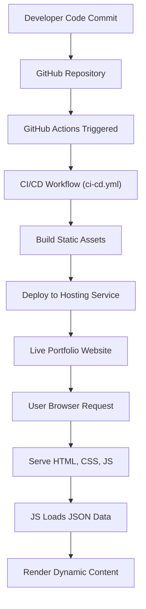

# 🚀 Dynamic Developer Portfolio Website

<p align="center"></p>

## Short Description
Showcase your skills, projects, and professional journey with this modern, responsive, and easily customizable developer portfolio website. Built with a focus on clean design, performance, and user experience, it provides a compelling platform to highlight your expertise and connect with opportunities.

## ✨ Key Features
*   **Stunning & Responsive Design:** A sleek, modern interface that looks impeccable on any device, from desktops to mobile phones.
*   **Interactive Project Showcase:** Dynamically loads your projects from `projects.json`, complete with descriptions, links, and visual previews.
*   **Comprehensive Skills Display:** Clearly categorize and present your technical proficiencies using data from `skills.json`.
*   **Detailed Experience Timeline:** Chronologically organized sections to detail your professional history and educational background.
*   **Integrated CI/CD Workflow:** Automated deployment via GitHub Actions ensures your portfolio is always up-to-date with your latest changes.
*   **Optimized Performance:** Fast loading times and smooth transitions for an excellent user experience.
*   **Customizable Content:** Easily update your information by modifying local JSON files – no complex backend required!
*   **Dedicated 404 Page:** A custom error page to gracefully handle broken links.
*   **Downloadable Resume:** Direct access to your resume (`assests/resume.pdf`) for easy sharing.

## Who is this for?
This portfolio is ideal for:
*   **Software Developers & Engineers:** Looking to present their work, skills, and experience to potential employers.
*   **Freelancers:** Seeking to impress clients with a professional online presence.
*   **Students & Graduates:** Building their first professional online portfolio to kickstart their careers.
*   **Tech Professionals:** Anyone in the tech industry who wants a polished, easy-to-manage personal website.

## Technology Stack & Architecture
This project is built using foundational web technologies, ensuring broad compatibility and ease of deployment.

*   **Frontend:**
    *   **HTML5:** For semantic structure and content.
    *   **CSS3:** Enhanced with `assests/css/style.css` for visually appealing and responsive layouts.
    *   **JavaScript (Vanilla JS):** Powering dynamic content loading, interactive elements, and overall user experience, including `particles.min.js` for engaging visual effects.
*   **Content Management:**
    *   **JSON Files:** `projects.json` and `skills.json` are used to structure and manage portfolio content, making updates simple and efficient without a database.
*   **Deployment & Automation:**
    *   **GitHub Actions:** Configured with `.github/workflows/ci-cd.yml` for continuous integration and continuous deployment (CI/CD), automating the build and deployment process.

## 📊 Architecture & Database Schema
This portfolio is a static site, meaning it primarily serves pre-built HTML, CSS, and JavaScript files directly to the browser. Content is dynamically injected on the client-side using JavaScript from local JSON files, eliminating the need for a traditional backend database. The architecture emphasizes robust deployment automation.



## ⚡ Quick Start Guide
Getting your personalized portfolio up and running is straightforward!

1.  **Clone the Repository:**
    ```bash
    git clone https://github.com/satshrawani33-code/portfolio_website.git
    cd portfolio_website
    ```
2.  **Explore the Code:**
    Open the project in your favorite code editor (e.g., VS Code).
3.  **Customize Your Content:**
    *   Edit `skills.json` to update your technical skills.
    *   Modify `projects/projects.json` to showcase your projects.
    *   Update `assests/resume.pdf` with your latest resume.
    *   Personalize the `index.html` and other HTML files with your details.
4.  **View Locally:**
    Open `index.html` directly in your web browser. For a full experience with dynamic content loading, it's recommended to serve it via a simple local HTTP server (e.g., using Python: `python -m http.server`).
5.  **Deploy (Optional):**
    This project is set up for automated deployment via GitHub Actions. Push your changes to your GitHub repository, and the `ci-cd.yml` workflow will handle the rest, deploying your site to a static hosting service.

## 📜 License
This project is licensed under the MIT License. See the `LICENSE` file for full details.